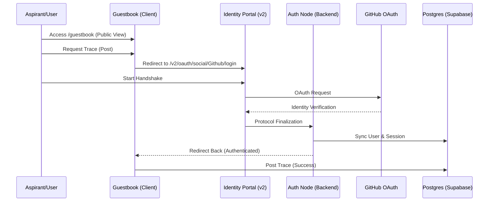

# EBNN_CORE: Auth V2 Protocol Documentation

## 1. Overview
The **v2 Protocol** modernization replaces legacy authentication with a secure, high-entropy identity handshake using **Better Auth** and **GitHub OAuth**. This system is designed for the sovereign digital archive, ensuring all traces (guestbook posts) are cryptographically linked to verified identities.

## 2. Technical Stack
- **Auth Engine**: `better-auth` v1.5.6+
- **ORM & Schema**: `drizzle-orm` v0.45.0+
- **Database Driver**: `postgres.js` (Optimized for Transaction Pooling)
- **Database Architecture**: Supabase (Postgres) with Drizzle Adapter
- **Frontend Logic**: Next.js App Router (Turbopack) with Framer Motion

## 3. Auth Architecture Diagram

## 4. Challenges Faced & Logic Fixes
| Feature | Challenge | Fix Implemented |
| :--- | :--- | :--- |
| **Routing** | 404 Errors on login page | Corrected fragmented Next.js dynamic routing structure (`[provider]/[token]`). |
| **Middlewares** | 500 Build error due to naming | Merged Better Auth checks into existing `proxy.ts` to satisfy Turbopack rules. |
| **DB Connection** | ENOTFOUND direct DB host | Switched to Supabase Transaction Pooler (Port 6543) for Vercel networking. |
| **Static Build** | Suspense bailout | Wrapped login hooks in `<Suspense>` to enable static page generation. |
| **Schema Sync** | Table relations not found | Created unified `SCHEMA.sql` to initialize `user`, `session`, and `account` tables. |

## 5. Protocol Endpoints
- **Base Auth Node**: `/api/auth/[...better-auth]` — Main API lifecycle.
- **Identity Portal**: `/v2/oauth/social/Github/login` — High-end glassmorphism login.
- **Handshake Verification**: `/v2/oauth/social/Github/[token]` — Dynamic challenge segment.
- **Health Diagnostics**: `/api/auth/health` — Real-time protocol diagnostic node.

## 6. Logic Explanations

### Backend Logic
The backend uses **Better Auth** as a sovereign middleware.
- **Drizzle Adapter**: Maps GitHub identity data into your Supabase database.
- **Session Management**: Each session is signed and stored in the `session` table with a **60-minute duration**.
- **Diagnostic Node**: A specialized `/health` endpoint verifies environment variables, TCP connection to the database, and table existence before processing auth requests.

### Frontend Logic
The frontend is a **Progressive Identification System**.
- **Dynamic Portal**: Uses `framer-motion` to create a "Secure Handshake" visual experience.
- **Token Challenge**: Implements a 3-minute UI timeout for entry, ensuring the aspirant completes the login within the secure window.
- **Client Sync**: Uses the `authClient` to provide reactive session states throughout the guestbook components.

## 7. Security Protocols
- **GitHub OAuth 2.0**: No passwords stored; identities verified by third-party authorities.
- **Secure Redirection**: All write-sensitive actions in the guestbook (Post, Edit, Delete) are protected by server-side session checks.
- **Protocol Handshake**: Users must pass through the v2 portal to finalize their identity status.
- **Session Revocation**: One-click protocol termination (Sign Out) clears all identity markers and tokens.

---

## **Credits**
- **Sovereign Frontend Design & UX**: [@erroraero](https://github.com/erroraero)
- **Protocol Integration & Backend Architecture**: [avrxt](https://github.com/avrxt)
- **Database Frequency & Infrastructure**: [@ebnn](https://github.com/Ebnxyz)
